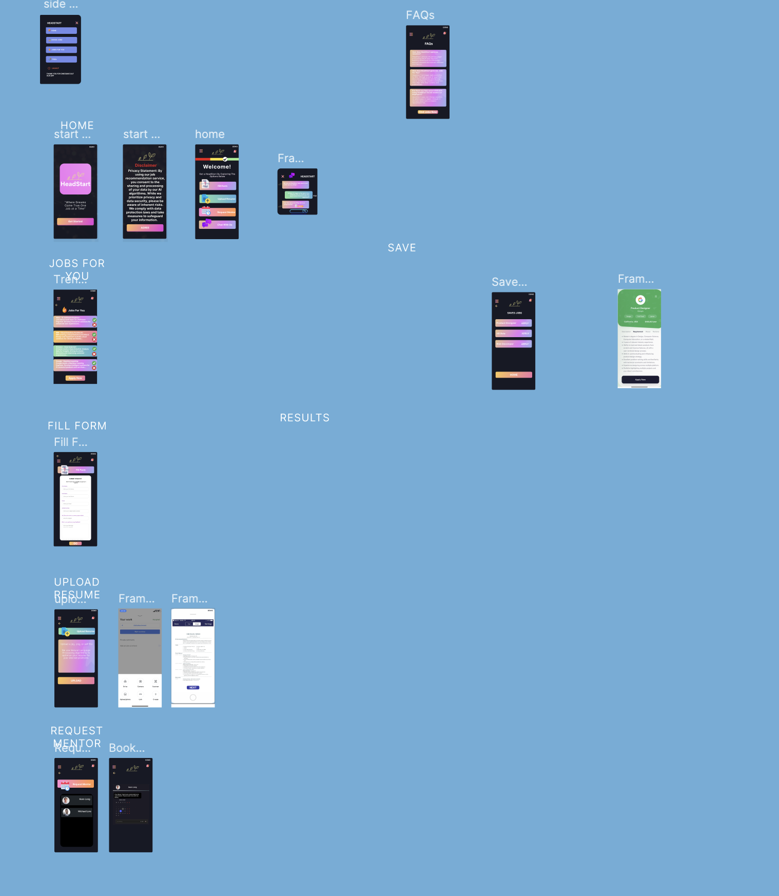
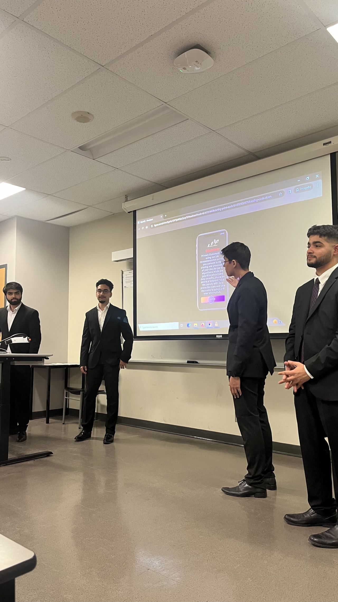

# Figma Prototype

## Overview
This was my first hackathon, where I learned Figma, created a business plan, and presented it in front of a panel. I secured second place in the event. This Figma prototype showcases the UI/UX design for An application dedicated to empowering immigrant talent in reaching their full potential through data analytics and AI.

## Wireframe
 

## Business Plan
Here are the slides from my business plan:
- 
 

## Certificate
Here’s my certificate from the hackathon:
-   

## Link to Prototype
[Headstart Prototype Link Here](https://www.figma.com/proto/cr9EGc3cyrNPc7galadGhD/Headstart-(Copy)?node-id=592-624&t=sgw1fwNVD8OLQb5U-1)
